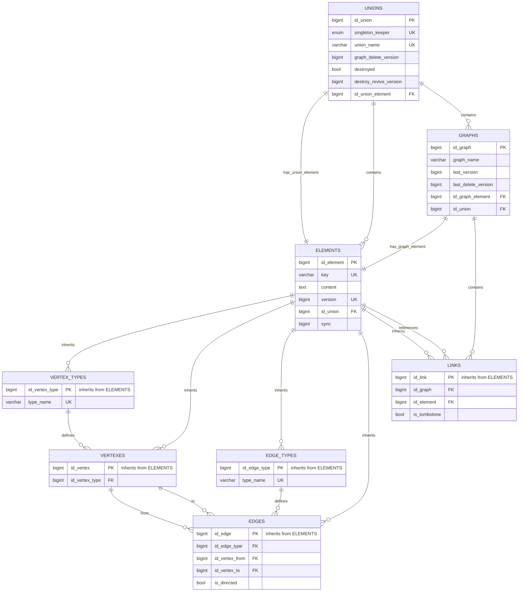

# VUnion Database Schema

## Entity Relationship Diagram

```mermaid
erDiagram
    UNIONS ||--|| ELEMENTS : "has_union_element"
    UNIONS ||--o{ ELEMENTS : contains
    UNIONS ||--o{ GRAPHS : contains
    UNIONS {
        bigint id_union PK
        enum singleton_keeper UK
        varchar union_name UK
        bigint graph_delete_version
        bool destroyed
        bigint destroy_revive_version
        bigint id_union_element FK
    }

    ELEMENTS ||--o{ VERTEX_TYPES : "inherits"
    ELEMENTS ||--o{ VERTEXES : "inherits"
    ELEMENTS ||--o{ EDGE_TYPES : "inherits"
    ELEMENTS ||--o{ EDGES : "inherits"
    ELEMENTS ||--o{ LINKS : "inherits"
    ELEMENTS ||--o{ LINKS : references
    ELEMENTS {
        bigint id_element PK
        varchar key UK
        text content
        bigint version UK
        bigint id_union FK
        bigint sync
    }

    VERTEX_TYPES ||--o{ VERTEXES : "defines"
    VERTEX_TYPES {
        bigint id_vertex_type PK "inherits from ELEMENTS"
        varchar type_name UK
    }

    VERTEXES ||--o{ EDGES : "from"
    VERTEXES ||--o{ EDGES : "to"
    VERTEXES {
        bigint id_vertex PK "inherits from ELEMENTS"
        bigint id_vertex_type FK
    }

    EDGE_TYPES {
        bigint id_edge_type PK "inherits from ELEMENTS"
        varchar type_name UK
    }

    EDGE_TYPES ||--o{ EDGES : "defines"
    EDGES {
        bigint id_edge PK "inherits from ELEMENTS"
        bigint id_edge_type FK
        bigint id_vertex_from FK
        bigint id_vertex_to FK
        bool is_directed
    }

    GRAPHS ||--|| ELEMENTS : "has_graph_element"
    GRAPHS ||--o{ LINKS : contains
    GRAPHS {
        bigint id_graph PK
        varchar graph_name
        bigint last_version
        bigint last_delete_version
        bigint id_graph_element FK
        bigint id_union FK
    }

    LINKS {
        bigint id_link PK "inherits from ELEMENTS"
        bigint id_graph FK
        bigint id_element FK
        bool is_tombstone
    }
```
